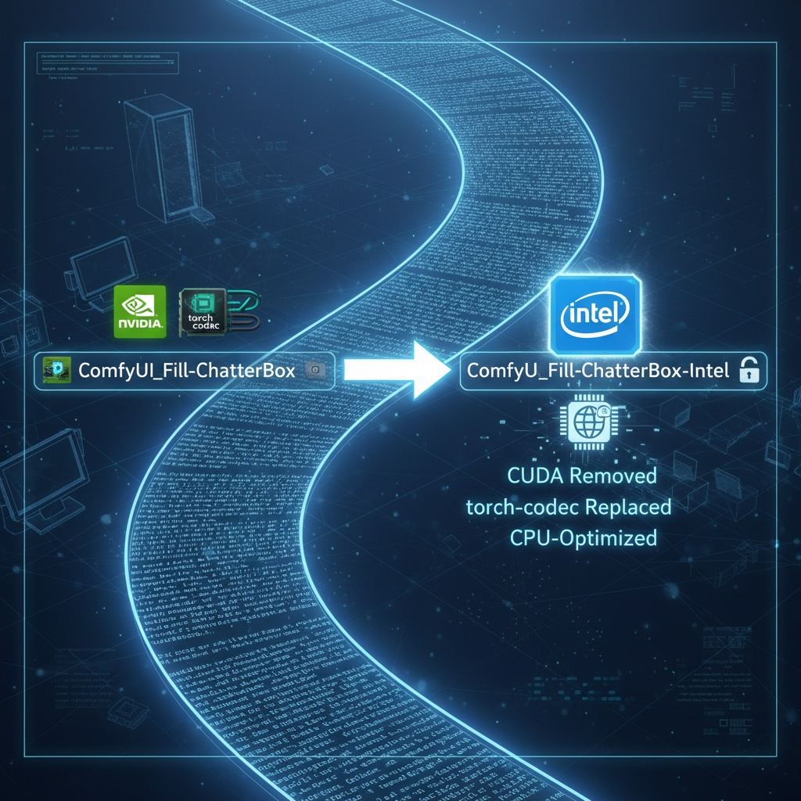

# ComfyUI_Fill-ChatterBox (Intel Arc XPU Compatible)

If you enjoy this project, consider supporting the original author on Patreon!
<p align="left">
  <a href="https://www.patreon.com/c/Machinedelusions">
    
  </a>
</p>

A custom node extension for ComfyUI that adds text-to-speech (TTS) and voice conversion (VC) capabilities using the Chatterbox library.

**🚀 INTEL ARC XPU COMPATIBLE VERSION**

This fork has been specifically modified to work with Intel Arc XPU systems by forcing TTS operations to run on CPU for optimal stability while allowing your ComfyUI to continue using XPU for image/video generation tasks.

Supports a MAXIMUM of 40 seconds. I've tried removing this limitation, but the model falls apart really badly with anything longer than that, so it remains.



## 🔧 Intel Arc XPU Compatibility Features

- **CPU-Forced TTS Operations**: All TTS and voice conversion operations run on CPU for maximum stability
- **XPU Detection**: Automatically detects Intel Arc XPU and applies appropriate compatibility settings
- **Flash Attention Disabled**: Removes CUDA-specific flash attention that causes issues on Intel Arc
- **Safe Model Loading**: Always loads models to CPU first, then transfers to appropriate device
- **Enhanced Error Handling**: Specific error handling and fallbacks for Intel Arc systems

## Installation

1. Clone this repository into your ComfyUI custom_nodes directory:
   ```
   cd /path/to/ComfyUI/custom_nodes
   git clone https://github.com/ai-joe-git/ComfyUI_Fill-ChatterBox-Intel.git
   ```

2. Install the base dependencies (Intel Arc Compatible):
   ```
   pip install -r ComfyUI_Fill-ChatterBox-Intel/requirements.txt
   ```

3. (Optional) Install watermarking support:
   ```
   pip install resemble-perth
   ```
   **Note**: The `resemble-perth` package may have compatibility issues with Python 3.12+. If you encounter import errors, the nodes will still function without watermarking. **Watermarking is automatically disabled on Intel Arc systems for stability.**

## Intel Arc XPU Requirements

- **Intel Arc GPU** (A370, A380, A750, A770, etc.)
- **Intel XPU PyTorch**: Make sure you have Intel's XPU-enabled PyTorch installed
- **ComfyUI with Intel Arc support**: Ensure your ComfyUI is set up to work with Intel Arc XPU
- **Fresh Intel Arc XPU compatible ComfyUI installation** as mentioned in your setup

## Usage

### Text-to-Speech Node (FL Chatterbox TTS - Intel Arc)
- Add the "FL Chatterbox TTS (Intel Arc)" node to your workflow
- Configure text input and parameters (exaggeration, cfg_weight, temperature)
- Optionally provide an audio prompt for voice cloning
- **Intel Arc Note**: TTS operations will automatically run on CPU regardless of GPU settings

### Voice Conversion Node (FL Chatterbox VC - Intel Arc)
- Add the "FL Chatterbox VC (Intel Arc)" node to your workflow
- Connect input audio and target voice
- **Intel Arc Note**: Voice conversion operations will automatically run on CPU for stability

### Dialog TTS Node (FL Chatterbox Dialog TTS - Intel Arc)
- Add the "FL Chatterbox Dialog TTS (Intel Arc)" node to your workflow
- This node is designed to synthesize speech for dialogs with up to 4 distinct speakers (SPEAKER A, SPEAKER B, SPEAKER C, and SPEAKER D)
- **Intel Arc Note**: All dialog processing runs on CPU while your XPU remains available for other ComfyUI tasks

**Inputs:**
- `dialog_text`: A multiline string where each line is prefixed by `SPEAKER A:`, `SPEAKER B:`, `SPEAKER C:`, or `SPEAKER D:`. For example:
  ```
  SPEAKER A: Hello, how are you?
  SPEAKER B: I am fine, thank you!
  SPEAKER C: What about you, Speaker D?
  SPEAKER D: I'm doing great as well!
  SPEAKER A: That's wonderful to hear.
  ```
- `speaker_a_prompt`: An audio prompt (AUDIO type) for SPEAKER A's voice (required)
- `speaker_b_prompt`: An audio prompt (AUDIO type) for SPEAKER B's voice (required)
- `speaker_c_prompt`: An audio prompt (AUDIO type) for SPEAKER C's voice (optional)
- `speaker_d_prompt`: An audio prompt (AUDIO type) for SPEAKER D's voice (optional)
- `exaggeration`: Controls emotion intensity (0.25-2.0)
- `cfg_weight`: Controls pace/classifier-free guidance (0.2-1.0)
- `temperature`: Controls randomness in generation (0.05-5.0)
- `use_cpu` (optional): Boolean, defaults to False. **Note**: CPU is forced on Intel Arc regardless of this setting
- `keep_model_loaded` (optional): Boolean, defaults to False. Keeps the model loaded in memory

**Outputs:**
- `dialog_audio`: Combined audio with all speakers
- `speaker_a_audio`: Isolated track for Speaker A (with silence for other speakers)
- `speaker_b_audio`: Isolated track for Speaker B (with silence for other speakers)
- `speaker_c_audio`: Isolated track for Speaker C (with silence for other speakers)
- `speaker_d_audio`: Isolated track for Speaker D (with silence for other speakers)

**Note:** SPEAKER C and SPEAKER D are optional. If their audio prompts are not provided, any dialog lines with "SPEAKER C:" or "SPEAKER D:" will be skipped.

## Intel Arc XPU Technical Details

### Device Management
- **TTS Operations**: Always executed on CPU for stability
- **Model Loading**: Models are loaded to CPU first, then moved to appropriate device
- **Flash Attention**: Disabled on Intel Arc systems (uses regular attention instead)
- **Watermarking**: Disabled on Intel Arc systems to prevent compatibility issues

### Performance Considerations
- TTS operations run on CPU but are optimized for Intel Arc systems
- Your Intel Arc XPU remains fully available for ComfyUI image/video generation
- Mixed CPU/XPU operation provides the best stability and performance balance

### Error Handling
- Automatic Intel Arc XPU detection
- Graceful fallbacks for XPU-specific errors
- Enhanced logging for Intel Arc compatibility issues

## Troubleshooting Intel Arc Issues

### Common Issues and Solutions

1. **"XPU not supported" errors**
   - This is expected and normal - TTS operations are designed to run on CPU
   - Your XPU will still be used for other ComfyUI operations

2. **Memory issues**
   - The `keep_model_loaded=False` is recommended on Intel Arc systems
   - Models are automatically unloaded after use to free memory

3. **Slow performance**
   - First-time model loading may take longer as models download
   - Subsequent uses should be faster with `keep_model_loaded=True`

## Change Log

### Intel Arc Compatibility Update (September 2025)
- **Added Intel Arc XPU detection and compatibility**
- **Forced CPU execution for all TTS operations on Intel Arc systems**
- **Disabled flash attention for Intel Arc compatibility**
- **Enhanced error handling and fallback mechanisms**
- **Safe model loading with CPU map_location for Intel Arc**
- **Updated all attention mechanisms to work with Intel Arc**
- **Added Intel Arc specific logging and debugging**

### 7/24/2025
- Added Dialog TTS node that handles up to 4 speakers (A, B, C, D) for conversation-style audio creation
- Extended all nodes (TTS, VC, Dialog) with seed parameters for reproducible generation
- SPEAKER C and SPEAKER D are optional in Dialog node - allows flexible 2-4 speaker conversations
- Each speaker gets isolated audio track output for advanced audio editing workflows

### 6/24/2025
- Added seed parameter to both TTS and VC nodes for reproducible generation
- Seed range: 0 to 4,294,967,295 (32-bit integer)
- Enables consistent audio output for debugging and workflow control
- Made Perth watermarking optional to fix Python 3.12+ compatibility issues
- Nodes now function without watermarking if resemble-perth import fails

### 5/31/2025
- Added Persistent model loading, and loading bar functionality
- Added Mac support (needs to be tested so HMU)
- Removed the chatterbox-tts library and implemented native inference code

## Credits

- **Original Author**: [filliptm](https://github.com/filliptm) (Machine Delusions)
- **Intel Arc Compatibility**: Modified for Intel Arc XPU systems
- **Based on**: [ResembleAI Chatterbox](https://github.com/resemble-ai/chatterbox)

## License

Same license as the original project. This is a compatibility fork focused on Intel Arc XPU support.

